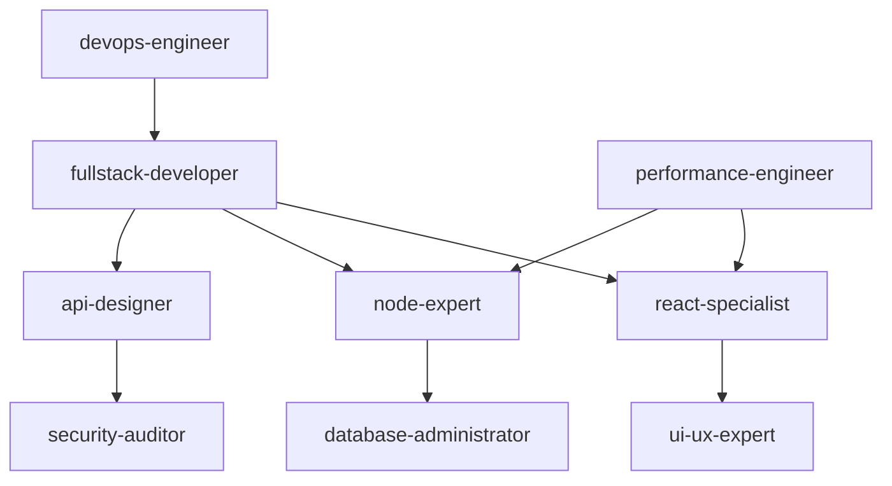

# Claude Code Sub-Agents Collection 🤖

> A comprehensive collection of specialized Claude AI sub-agents for software development teams

## 🚀 Overview

This repository contains a curated collection of **specialized Claude AI sub-agents** designed to support every aspect of modern software development. Each agent is crafted with deep domain expertise, specific toolsets, and optimized workflows to provide professional-grade assistance across the entire development lifecycle.

## 🎯 Agent Types

We provide **two types** of Claude code sub-agents to match different complexity needs:

### 📝 Simple Agents
- **Quick Setup**: Lightweight agents for general development tasks
- **Broad Coverage**: General expertise across common use cases
- **Fast Deployment**: Ready-to-use with minimal configuration
- **Beginner Friendly**: Perfect for getting started or general assistance

### ⚡ Advanced Agents
- **Deep Specialization**: Highly specialized agents for complex, specific scenarios
- **Enterprise Grade**: Professional-level expertise with comprehensive toolsets
- **Advanced Workflows**: Structured processes and detailed quality checklists
- **Team Integration**: Designed for collaborative development environments

---

## 📁 Agent Categories

### 🛠️ Agent Specialists
*End-to-end development and architecture experts*

#### Simple Agents
| Agent | Description | Best For | Link |
|-------|-------------|----------|------|
| **api-designer** | API design and documentation | Designing REST/GraphQL APIs | [View Agent](./simple-agents/api-designer.md) |
| **backend-developer** | Basic backend development support | Simple APIs, CRUD operations | [View Agent](./simple-agents/backend-developer-generic.md) |
| **code-reviewer** | Code review and feedback | Improving code quality | [View Agent](./simple-agents/code-reviewer.md) |
| **database-expert** | Database design and queries | Schema, migrations, SQL | [View Agent](./simple-agents/database-expert.md) |
| **devops-engineer** | CI/CD and automation | Deployments, pipelines | [View Agent](./simple-agents/devops-engineer.md) |
| **frontend-developer** | General frontend development help | Basic UI components, simple interactions | [View Agent](./simple-agents/frontend-developer-generic.md) |
| **fullstack-developer** | General full-stack development assistance | Small projects, prototyping, learning | [View Agent](./simple-agents/fullstack-developer.md) |
| **graphql-architect** | GraphQL API design | GraphQL schemas, queries | [View Agent](./simple-agents/graphql-architect.md) |
| **microservices-architect** | Microservices design | Distributed systems | [View Agent](./simple-agents/microservices-architect.md) |
| **mobile-developer** | Mobile app development | iOS, Android basics | [View Agent](./simple-agents/mobile-developer.md) |
| **performance-engineer** | Performance optimization | Speed, profiling | [View Agent](./simple-agents/performance-engineer.md) |
| **product-manager** | Product planning | Roadmaps, features | [View Agent](./simple-agents/product-manager.md) |
| **project-manager** | Project management | Tasks, timelines | [View Agent](./simple-agents/project-manager.md) |
| **qa-automation-generic** | QA automation | Test scripts, automation | [View Agent](./simple-agents/qa-automation-generic.md) |
| **react-expert** | React development | Advanced React | [View Agent](./simple-agents/react-expert.md) |
| **security-expert** | Security best practices | Secure coding | [View Agent](./simple-agents/security-expert.md) |
| **typescript-pro** | TypeScript expertise | Typings, advanced TS | [View Agent](./simple-agents/typescript-pro.md) |
| **ui-expert** | UI/UX design | User interfaces | [View Agent](./simple-agents/ui-expert.md) |
| **vue-expert** | Vue.js development | Vue apps | [View Agent](./simple-agents/vue-expert.md) |
| **websocket-engineer** | WebSocket integration | Real-time apps | [View Agent](./simple-agents/websocket-engineer.md) |

#### Advanced Agents
| Agent | Description | Key Tools | Best For | Link |
|-------|-------------|-----------|----------|------|
| **api-designer** | Advanced API design and governance | OpenAPI, Swagger | API-first enterprise | [View Agent](./advanced-agents/api-designer.md) |
| **backend-expert** | Advanced backend systems | Node.js, Python, Go | Scalable backends | [View Agent](./advanced-agents/backend-expert.md) |
| **cloud-architect** | Cloud infrastructure design | AWS, Azure, Terraform | Cloud solutions | [View Agent](./advanced-agents/cloud-architect.md) |
| **devops-engineer** | Advanced CI/CD & automation | Docker, Kubernetes | Enterprise DevOps | [View Agent](./advanced-agents/devops-engineer.md) |
| **fullstack-developer** | End-to-end feature development specialist | Node.js, React, PostgreSQL, Docker | Enterprise applications, complex features | [View Agent](./advanced-agents/fullstack-developer.md) |
| **mobile-developer** | Cross-platform mobile application expert | React Native, Flutter, Xcode, Android Studio | Mobile app development, cross-platform solutions | [View Agent](./advanced-agents/mobile-developer.md) |
| **node-expert** | Node.js advanced development | Node.js, Express | High-performance Node | [View Agent](./advanced-agents/node-expert.md) |
| **performance-engineer** | Advanced performance optimization | Profilers, APM | High-load systems | [View Agent](./advanced-agents/performance-engineer.md) |
| **python-expert** | Python advanced development | Python, Django, Flask | Data, backend, scripting | [View Agent](./advanced-agents/python-expert.md) |
| **react-specialist** | Advanced React engineering | React, Next.js | Complex UIs | [View Agent](./advanced-agents/react-specialist.md) |
| **security-auditor** | Security audits and compliance | Pen-testing, audits | Secure enterprise | [View Agent](./advanced-agents/security-auditor.md) |
| **typescript-expert** | TypeScript advanced usage | TypeScript, tsconfig | Large TS codebases | [View Agent](./advanced-agents/typescript-expert.md) |
| **ui-ux-expert** | UI/UX advanced design | Figma, design systems | Enterprise UI/UX | [View Agent](./advanced-agents/ui-ux-expert.md) |
| **vue-expert** | Vue.js advanced development | Vue, Vuex, Nuxt | Large Vue apps | [View Agent](./advanced-agents/vue-expert.md) |

## 🚀 Quick Start

### Prerequisites

- Claude AI API access
- Development environment setup
- Basic understanding of software development workflows

### Choosing the Right Agent Type

#### Use Simple Agents When:
- ✅ Learning new technologies
- ✅ Working on personal or small projects
- ✅ Need quick assistance or guidance
- ✅ Building prototypes or MVPs
- ✅ Getting started with a technology

#### Use Advanced Agents When:
- 🚀 Working on enterprise or production applications
- 🚀 Need deep technical expertise
- 🚀 Building complex, scalable systems
- 🚀 Require comprehensive quality assurance
- 🚀 Working in team environments

## 📖 Agent Documentation

Each agent includes:

- **🎯 Specialized Expertise**: Detailed technical knowledge areas
- **🛠️ Tool Integration**: Pre-configured development tools
- **📋 Workflow Processes**: Structured development approaches
- **🤝 Collaboration Patterns**: Integration with other agents
- **✅ Quality Checklists**: Comprehensive verification procedures
- **📚 Best Practices**: Industry-standard methodologies

## 🔄 Agent Collaboration

Agents are designed to work together seamlessly:

## 🙏 Acknowledgments

- Built with [Claude AI](https://anthropic.com/claude)
- Inspired by modern software development practices
- Community-driven development approach

---

**Made with ❤️ by the developer community**

*Empowering development teams with specialized AI assistance at every level*